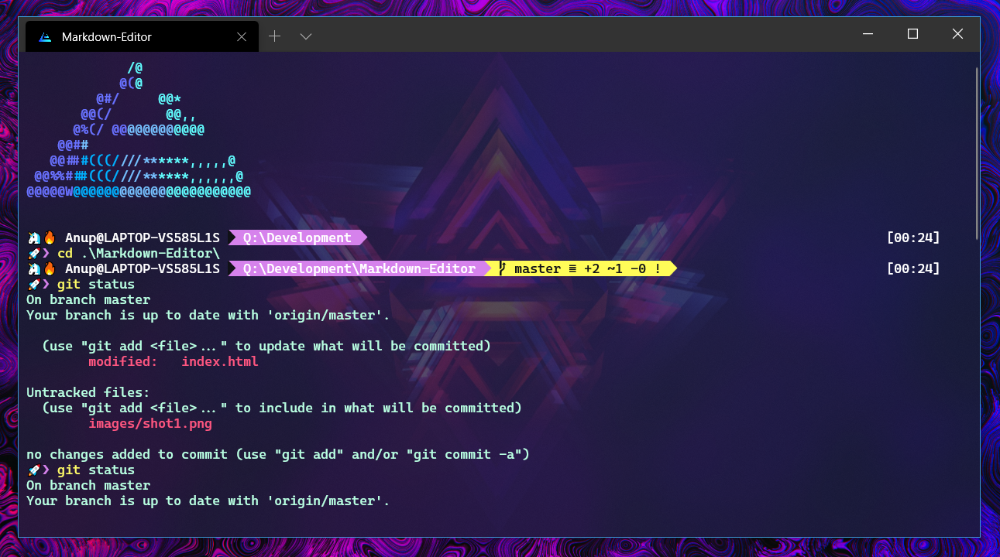
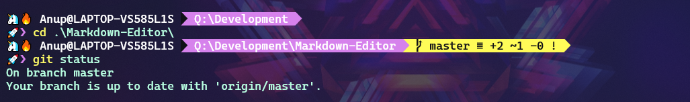
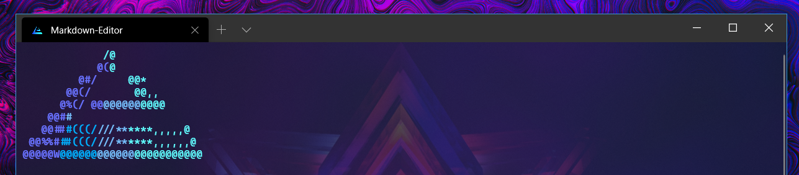

# Beautify your Windows Terminal 🦄

The Windows Terminal is a modern, fast, efficient, powerful, and productive terminal application for users of command-line tools and shells like Command Prompt, PowerShell, and WSL. 

---

---
Lets start with **windows Terminal** installation -

 -  Install the Windows Terminal from the Microsoft Store. This allows you to always be on the latest version when we release new builds with automatic upgrades.
- **Alternative Way** (Via Chocolately)
				- `choco install microsoft-windows-terminal`

Next Step is to modify Windows Terminal settings.

Fire up your installed windows terminal, and open up its settings, which will open settings.json in your default editor.
 
 1. Under profiles list update the powershell profile to -
 
 Properties - **name**-[ *Appears as title in top bar* ]
 	      **acrylicOpacity**-[ *its just the opacity of window* ]
	      **useAcrylic**-[ *to use acrylicOpacity it must be true*]
	      **icon**-[ *appears as favicon to window* ]
 ```
 {
       // Make changes here to the powershell.exe profile.
       "guid": "{61c54bbd-c2c6-5271-96e7-009a87ff44bf}",
       "name": "Linnea",
       "commandline": "powershell.exe -NoLogo -NoExit",
       "hidden": false,
       "colorScheme": "Blue Matrix",
       "fontFace": "Cascadia Code PL",
       "fontSize": 10,
       "icon": "xxxxxxxxxxxxxxxxxxxxxx",
       "backgroundImage": "xxxxxxxxxxxxxxxxxxx",
       "backgroundImageOpacity": 0.2,
       "acrylicOpacity": 0.8,
       "useAcrylic": true,
       "startingDirectory": "Q:\\Development"
 },
 ```
 *(Note 1- make sure to update icon and background image to your personal liking)*
  *(Note 2- make sure to that your defaultProfile has the guid of your powershell)*
 
 2. Next step is to update our schemes list -
 ```
     "schemes": [
        {
            "name": "Blue Matrix",
            "black": "#101116",
            "red": "#ff5680",
            "green": "#00ff9c",
            "yellow": "#fffc58",
            "blue": "#00b0ff",
            "purple": "#d57bff",
            "cyan": "#76c1ff",
            "white": "#c7c7c7",
            "brightBlack": "#686868",
            "brightRed": "#ff6e67",
            "brightGreen": "#5ffa68",
            "brightYellow": "#fffc67",
            "brightBlue": "#6871ff",
            "brightPurple": "#d682ec",
            "brightCyan": "#60fdff",
            "brightWhite": "#ffffff",
            "background": "#1d2342",
            "foreground": "#b8ffe1"
        }
    ],
 ```
More themes at - [atomcorp.github.io/themes/](https://atomcorp.github.io/themes/)

That's pretty much for the windows Terminal Settings , lets move to add some cool plugins 🔥.

---

### PowerLine Setup ⚡


 Prerequisites - 
 - Install [Cascadia code PL](https://github.com/microsoft/cascadia-code/releases) font. (Otherwise you might some gibberish on your terminal )
 - [Git](https://git-scm.com/downloads) for windows
 - Install Posh-git and Oh-my-posh  ( use powershell )
 ```
 Install-Module posh-git -Scope CurrentUser
Install-Module oh-my-posh -Scope CurrentUser
```
---

####  Customize your PowerShell prompt 🔨
 - Open your PowerShell profile with `notepad $PROFILE` or the text editor of your choice. This is not your Windows Terminal profile. Your PowerShell profile is a script that runs every time PowerShell starts.
 -  If your powershell doesn't already have a profile, create one -> 
 ```
    if (!(Test-Path -Path $PROFILE)) { New-Item -ItemType File -Path ROFILE -Force }
```
- Now go ahead and add the following code to your powershell profile -
```
Import-Module posh-git
Import-Module oh-my-posh
Set-Theme Paradox
```
More themes at - [ oh-my-posh themes](https://github.com/JanDeDobbeleer/oh-my-posh#themes)

( ⚠️  if your powershell gives module not found error ) add the following code with default module location, to the top of your Powershell Profile.
```
$env:PSModulePath = $env:PSModulePath + "$([System.IO.Path]::PathSeparator)C:\Users\xxxx\Documents\WindowsPowerShell\Modules"
```
Still facing error - Visit [https://docs.microsoft.com/en-us/powershell/module/microsoft.powershell.core/about/about_profiles?view=powershell-7](https://docs.microsoft.com/en-us/powershell/module/microsoft.powershell.core/about/about_profiles?view=powershell-7)


---
### Modifying Oh-my-posh theme ( 🦄🔥🚀 Emojis )



---
Remember we set our default oh-my-posh theme to paradox, lets head over to customize it.

- Navigate to your PSmodules directory, then into oh-my-posh themes directory 
	- `Documents\WindowsPowerShell\Modules\oh-my-posh\2.0.412\Themes`

- Open Paradox file, scroll down to the bottom and update following lines -

```
$sl.PromptSymbols.StartSymbol = [char]::ConvertFromUtf32(0x01F984) + [char]::ConvertFromUtf32(0x0001F525) + ' '
$sl.PromptSymbols.PromptIndicator = [char]::ConvertFromUtf32(0x01F680) +[char]::ConvertFromUtf32(0x276F)
```
*(This lines will add cool emojis just before your StartSymbol & PromptIndicator)*

---

### Adding custom banner to your Powershell 🏳️‍🌈


This is quite tedious task if you want to add complex images in the banner.
( There is easier way [Neofetch for windows](https://github.com/dylanaraps/neofetch), but it comes with its own lag overhead whenever you open your windows terminal )

- *Tedious but way less overhead* Method
	-  Change your powershell file to add your custom ascii art. 
	-  In my case, I changed my Profile Image to Ascii Art via [https://www.topster.net/ascii-generator/](https://www.topster.net/ascii-generator/).
	- Next problem is color support, by default powershell doesn't allow you to write multipler colored text on a single line.
	-  ( You could proceed without this ) If want the above function install Write color module.
	`Install-Module -Name PSWriteColor`
	- Now just below your $psenvmodule path add the following lines to display your customized banner .
```
Write-Color -Text  "             /@ "         -Color Cyan
Write-Color -Text "            @(","@ "               -Color Blue,Cyan
Write-Color -Text "          @@/","    @*  "         -Color Blue, Cyan
Write-Color -Text "         @#/","     @@*  "        -Color Blue, Cyan
Write-Color -Text "       @@(/","       @@,, "       -Color Blue, Cyan
Write-Color -Text "      @%(/ @@","@@@@@@","@@@@ "      -Color Blue, DarkCyan, Cyan
Write-Color -Text "    @@#","#","                 "  -Color Blue, DarkCyan, Cyan
Write-Color -Text "   @@##","#(((/","///**","****,,,,,@ "  -Color Blue, DarkBlue, DarkCyan, Cyan
Write-Color -Text " @@%%#","##(((/","///**","****,,,,,,@ " -Color Blue, DarkBlue, DarkCyan, Cyan
Write-Color -Text "@@@@@W","@@@@@@","@@@@@@","@@@@@@@@@@@ "   -Color Blue, DarkBlue, DarkCyan, Cyan
Write-Color -Text " "
```

*(Note - the number of colors you can choose from is somewhat limited: Black, DarkBlue, DarkGreen, DarkCyan, DarkRed, DarkMagenta, DarkYellow, Gray, DarkGray, Blue, Green, Cyan, Red, Magenta, Yellow, and White )*

----

## Credits

- [Windows Terminal Community ❤](https://github.com/microsoft/terminal) 
 - [https://github.com/JanDeDobbeleer/oh-my-posh](https://github.com/JanDeDobbeleer/oh-my-posh)
 - [https://github.com/dahlbyk/posh-git](https://github.com/dahlbyk/posh-git)
 - [https://github.com/EvotecIT/PSWriteColor](https://github.com/EvotecIT/PSWriteColor)
 - [https://github.com/atomcorp/themes](https://github.com/atomcorp/themes)
